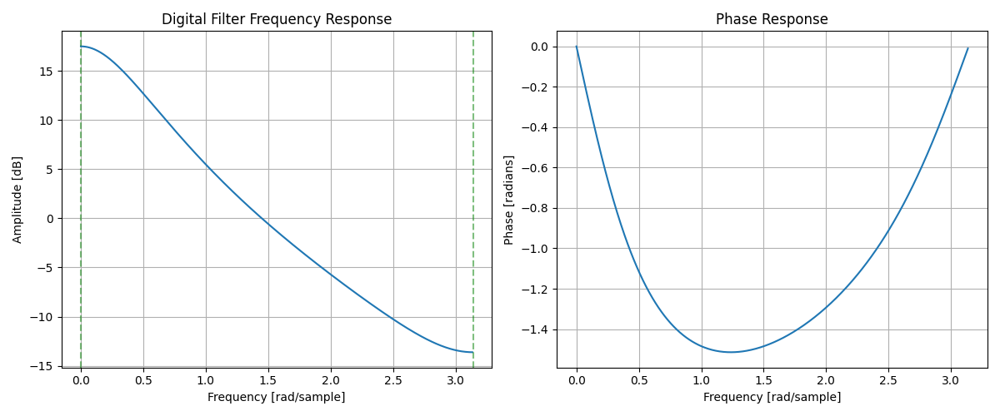
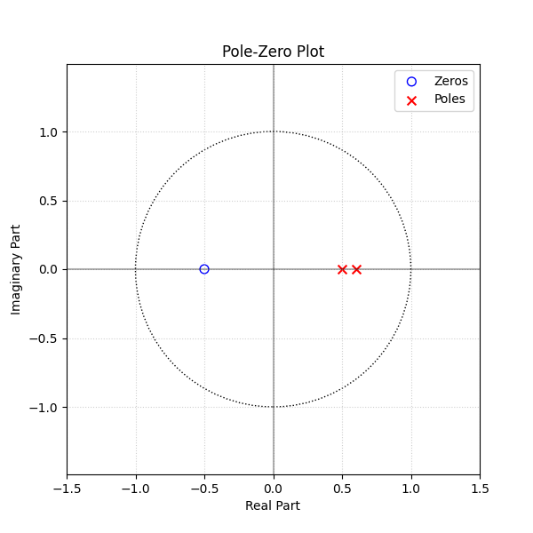

# Assignment 5: System Characterization via z-Transform

## 1. Transfer Function from Difference Equation
**System:**
$$y[n] - 1.1y[n-1] + 0.3y[n-2] = x[n] + 0.5x[n-1]$$

**(a) Derive H(z):**
Taking the z-transform of both sides:
$$Y(z) - 1.1z^{-1}Y(z) + 0.3z^{-2}Y(z) = X(z) + 0.5z^{-1}X(z)$$
$$Y(z) [1 - 1.1z^{-1} + 0.3z^{-2}] = X(z) [1 + 0.5z^{-1}]$$

The transfer function $H(z) = \frac{Y(z)}{X(z)}$ is:
$$H(z) = \frac{1 + 0.5z^{-1}}{1 - 1.1z^{-1} + 0.3z^{-2}}$$

**(b) Coefficients:**
Expressing in the form $H(z) = \frac{b_0 + b_1 z^{-1} + \dots}{1 + a_1 z^{-1} + a_2 z^{-2}}$:
$$H(z) = \frac{1 + 0.5z^{-1}}{1 - 1.1z^{-1} + 0.3z^{-2}}$$

Coefficients:
- Numerator $\{b_k\}$: $b_0 = 1, b_1 = 0.5$
- Denominator $\{a_k\}$: $a_0=1, a_1 = -1.1, a_2 = 0.3$

---

## 2. Pole-Zero Analysis and Stability

**(a) Poles and Zeros:**
Zeros (roots of numerator $1 + 0.5z^{-1}$):
$$1 + 0.5z^{-1} = 0 \implies z = -0.5$$
Zero at $z = -0.5$.

Poles (roots of denominator $1 - 1.1z^{-1} + 0.3z^{-2}$):
Multiply by $z^2$: $z^2 - 1.1z + 0.3 = 0$.
Roots using quadratic formula:
$$z = \frac{1.1 \pm \sqrt{1.1^2 - 4(1)(0.3)}}{2} = \frac{1.1 \pm \sqrt{1.21 - 1.2}}{2} = \frac{1.1 \pm \sqrt{0.01}}{2}$$
$$z = \frac{1.1 \pm 0.1}{2}$$
$p_1 = \frac{1.2}{2} = 0.6$
$p_2 = \frac{1.0}{2} = 0.5$

Poles at $z = 0.6$ and $z = 0.5$.

**(b) Pole-Zero Plot:**
- Zero at $z = -0.5$ (on real axis, left half).
- Poles at $z = 0.5, 0.6$ (on real axis, right half).
*(See `pole_zero_plot.png` generated below)*

**(c) Stability:**
A causal LTI system is BIBO stable if all poles lie **strictly inside the unit circle** ($|p| < 1$).
Here, poles are $0.5$ and $0.6$.
Since $|0.5| < 1$ and $|0.6| < 1$, the system is **Stable**.

**(d) System Type:**
The system has poles (denominator order > 0), meaning $y[n]$ depends on past outputs ($y[n-1], \dots$).
Thus, it has an impulse response of infinite duration.
The system is **IIR (Infinite Impulse Response)**.

---

## 3. Python – Frequency Response Plot

**(a) Magnitude and Phase Plot:**
See the generated plot below.

**(b) Gain Analysis:**
Using the plot and analytical check:
- **DC Gain ($\omega = 0, z = 1$):**
$$H(e^{j0}) = H(1) = \frac{1 + 0.5}{1 - 1.1 + 0.3} = \frac{1.5}{0.2} = 7.5$$
Magnitude: $20 \log_{10}(7.5) \approx 17.5$ dB.

- **Nyquist Gain ($\omega = \pi, z = -1$):**
$$H(e^{j\pi}) = H(-1) = \frac{1 - 0.5}{1 + 1.1 + 0.3} = \frac{0.5}{2.4} \approx 0.208$$
Magnitude: $20 \log_{10}(0.208) \approx -13.6$ dB.

**(c) Pole-Zero Influence:**
- The poles are at $z=0.5, 0.6$. These are positive real poles, closest to the unit circle at $\omega=0$ ($z=1$).
- This proximity to $\omega=0$ causes a **rise in magnitude at low frequencies** (Low Pass behavior), which explains the high DC gain.
- The zero at $z=-0.5$ is on the negative real axis ($\omega=\pi$). This suppresses high frequencies, contributing to the low magnitude at $\pi$.

### generated Plots

